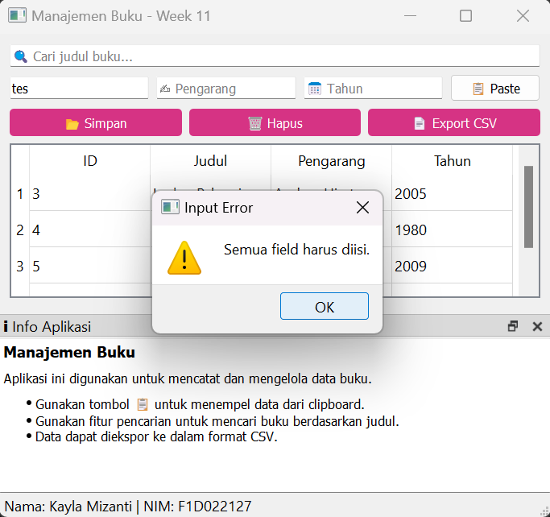

<table align="center">
  <tr>
    <td align="center">
       
      <b>Tampilan 1</b>
    </td>
    <td align="center">
       
      <b>Tampilan 2</b>
    </td>
  </tr>
  <tr>
    <td align="center">
       
      <b>Tampilan 3</b>
    </td>
    <td align="center">
       
      <b>Tampilan 4</b>
    </td>
  </tr>
  <tr>
    <td align="center">
       
      <b>Tampilan 5</b>
    </td>
    <td align="center">
       
      <b>Tampilan 6</b>
    </td>
  </tr>
</table>
